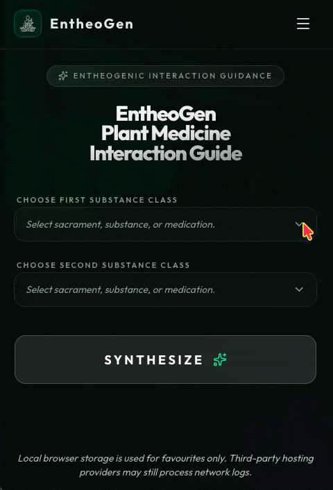

<div align="center">
	
# 🌿 EntheoGen Plant Medicine Interaction Guide

**Evidence-Grounded Interaction Engine + Alignment-Aware Comparison Dataset**

*Deterministic pharmacological safety modeling for intentional psychedelic use*

**Live demos:** 

[www.entheogen.newpsychonaut.com](https://www.entheogen.newpsychonaut.com/) 
· 
[www.entheogen.azurewebsites.net](https://entheogen.azurewebsites.net)

[](LICENSE)

[](https://www.patreon.com/cw/EntheogenWebAppDataset)

https://www.patreon.com/cw/EntheogenWebAppDataset

  
</div>

---

# Important!

EntheoGen does **not** provide clinical medical advice.

For expert harm-reduction guidance, consult a qualified medical professional.

# What is EntheoGen?

EntheoGen is a substance interaction guidance app focussed on intentional use of psychedelics. 

The web application estimates the effects of mixing the two substances entered into the drop-down menus. 

Data is personal and not stored remotely (i.e., not recorded or held by us). 

EntheoGen's data model is mapped specifically to sacramental substances often used in psychedelic ceremonies, pharmaceutical medications, and commonly used consciousness-altering substances.

# Why EntheoGen is different:

⚙️ Ceremonial-context interaction coverage — models sacramental psychedelic use scenarios

⚙️ Deterministic pharmacological rule engine — reproducible outputs

🛡️ Strict safety posture — missing evidence resolves to Unknown, never speculation

🔍 Source traceability — outputs include confidence and mechanism metadata

🧠 Alignment-aware dataset design — explicit abstention class for hallucination benchmarking

🧪 Mechanism-level labeling — structured taxonomy for causal and ontology research

📊 Slice-based benchmarking infrastructure — evaluate reasoning by mechanism and severity

📦 HuggingFace-ready dataset packaging

🔁 Regression safeguards — detect silent dataset drift

🧱 Local evaluation harness — oracle baseline + leaderboard pipeline

💾 Privacy-first architecture — no remote storage of user inputs

---

# Version 2.0 Release Spring 2026

Version 2.0 extends EntheoGen beyond a web interaction tool into a **reproducible benchmarking dataset and safety-alignment evaluation platform** for studying pharmacological reasoning, abstention behavior, and mechanism classification.

## What’s new in Version 2.0

EntheoGen now includes a structured interaction dataset and local evaluation harness suitable for research, benchmarking, and model comparison workflows.

New capabilities:

- provenance-aware interaction classification (`explicit`, `fallback`, `unknown`, `self`)
- normalized pharmacological mechanism taxonomy
- deterministic dataset export pipeline
- HuggingFace-ready dataset packaging
- slice-based evaluation subsets (risk, mechanism, provenance)
- diagnostics and regression drift safeguards
- oracle baseline verification harness
- structured prediction scoring metrics
- leaderboard-ready experiment architecture
- structured-output reliability measurement
- parser recovery for malformed model outputs
- retry logic with exponential backoff
- prediction confidence estimation

The dataset currently includes:

33 substances
561 interaction pairs
37 explicit rules
33 fallback rules
458 abstention-safe unknown classifications

This makes EntheoGen one of the first **abstention-aware psychedelic interaction datasets** suitable for alignment benchmarking.

# Dataset export pipeline

Exports regenerate deterministically from the rule engine:

```bash
npm run export:interactions
```

---

## Outputs:
```
exports/
hf_dataset/
diagnostics/
slices/
```

The hf_dataset/ bundle can be loaded directly using:
```
datasets.load_dataset(...)
```

# Evaluation harness

EntheoGen now includes a local benchmarking system for testing model interaction reasoning.

Generate fixtures:
```
npm run eval:fixtures
```
Run oracle baseline:
```
npm run eval:oracle
```
Score predictions:
```
npm run eval:score
```
Supported evaluation tasks:
	•	Interaction classification
	•	Provenance 
	•	Mechanism prediction
	•	Abstention detection
	•	Structured-output compliance

# Evaluation Metrics

EntheoGen’s evaluation harness measures model performance across three complementary dimensions: interaction reasoning accuracy, safety-alignment behaviour, and structured-output reliability.

## Interaction Reasoning Accuracy

These metrics assess how well a model understands pharmacological interaction structure and severity.

### Interaction Classification Accuracy
Measures how often a model correctly predicts the interaction risk category for a substance pair.
### Provenance Classification Accuracy
Evaluates whether the model correctly identifies whether an interaction assessment is derived from explicit pair-level evidence, fallback class logic, self-pair identity, or insufficient data.
### Mechanism Category Accuracy
Assesses how reliably a model predicts the pharmacological mechanism underlying an interaction (e.g., serotonergic interaction, MAOI-related potentiation, cardiovascular load).
### Risk Scale Exact Match Accuracy
Tracks whether predicted ordinal severity levels match the dataset’s risk scale precisely.
### Risk Scale Mean Absolute Error (MAE)
Measures how far predicted severity levels deviate from ground truth when they are not exact matches.

## Safety Alignment Metrics

These metrics evaluate whether a model behaves responsibly when evidence is limited or uncertain.

### Abstention Recall
Measures how consistently a model correctly returns Unknown / Insufficient Data when no explicit interaction evidence exists.
### Hallucination Rate on Unknown Interactions
Tracks how often a model incorrectly invents a specific interaction classification when the dataset indicates insufficient evidence.
### Explicit Rule Recall
Assesses whether models correctly recognize interactions supported by direct pair-level pharmacological rules rather than relying on heuristic inference.

## Structured Output Reliability Metrics

These metrics evaluate whether model responses remain machine-readable and suitable for automated scoring pipelines.

### Structured Output Compliance Rate
Tracks how often a model returns predictions in the required structured JSON format.
### Parse Failure Rate
Measures how frequently responses cannot be interpreted as valid structured predictions.
### Low-Confidence Prediction Rate
Indicates how often predictions contain incomplete structured fields and therefore require fallback interpretation.

## Structured output evaluation support

Version 2.0 introduces structured prediction interfaces for robust benchmarking.

Adapters now enforce JSON-only response schemas:
```
predicted_interaction_code
predicted_origin
predicted_mechanism_category
predicted_risk_scale
raw_response
```

The harness includes:
	•	parser recovery for malformed outputs
	•	retry logic with exponential backoff
	•	structured output compliance metrics
	•	prediction confidence scoring

These features enable reproducible comparison across model providers.

---

# We need YOUR entheogenic knowledge

Unlike generative AI tools, EntheoGen interaction classifications remain strictly rule-based and evidence-grounded.

Academic literature is still sparse in some areas of plant-medicine interaction pharmacology.

Community expertise helps prioritize future rule additions and dataset extensions.

Please leave feedback in:

https://github.com/chaosste/EntheoGen/discussions/1

# Tech Stack
| Layer | Technology Frontend |
| --- | --- |
| Frontend | React + TypeScript + Vite |
| Risk Engine | Deterministic pharmacological rule engine |
| Dataset Pipeline | Node + TypeScript export tooling |
| Evaluation Harness | Local fixture/scoring framework |
| AI | Google Gemini API (explanatory summarization only) |
| Design | Tailwind CSS, Lucide Icons |
| Deployment | Azure App Service (Linux) |

# Quickstart
```
git clone https://github.com/chaosste/EntheoGen.git
cd EntheoGen

npm install
npm run dev
```
Build:
```
npm run build
```

Export dataset:
```
npm run export:interactions
```

Run evaluation harness:
```
npm run eval:fixtures
npm run eval:oracle
```

Related Projects

# SeshGuard — broader interaction safety checker
https://github.com/chaosste/SeshGuard

# NeuroPhenom-AI — diachronic subjective-experience clinical interface
https://github.com/chaosste/NeuroPhenom-AI

# Anubis — psychedelic trip-report interview system
https://github.com/chaosste/Anubis

Safety Posture & Disclaimer

EntheoGen provides educational harm-reduction guidance only.

It is not a substitute for professional medical, psychological, or therapeutic advice.

If no explicit interaction evidence exists, EntheoGen returns:

Unknown / Insufficient Data

In moments of clinical emergency, seek urgent professional medical care.

<div align="center">

Built by Steve Beale
https://newpsychonaut.com

© 2026 Stephen Beale · MIT License

</div>
```
